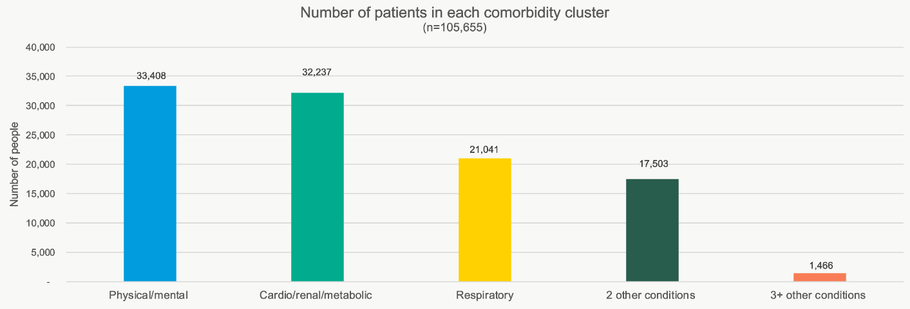
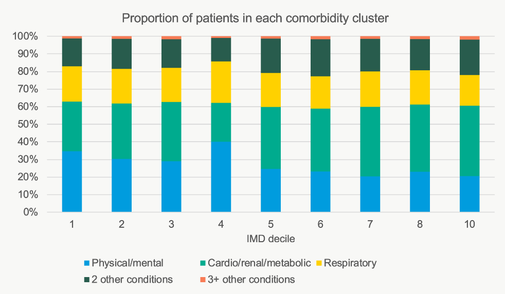
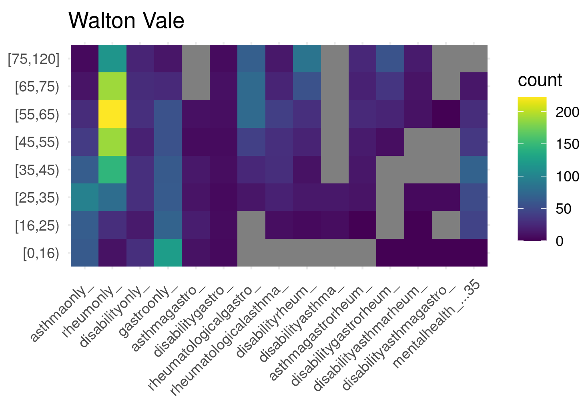
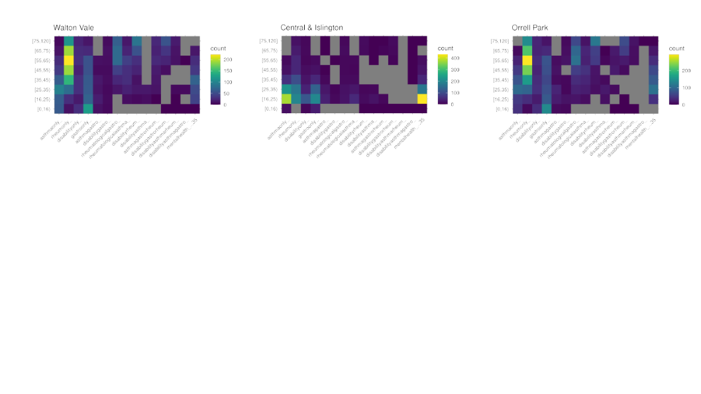

---
hide:
- toc
tags:
- Stage 1
- Quantitative population intelligence
---

# Primary care data - Liverpool

## Objectives
To develop the larger SysteMatic project, we invited stakeholders -- including people with lived experience of MLTCs -- to workshops focused on priority-setting.  We wanted people to be able to combine their individual experiences and narratives with context provided by higher-level, summary population data about the regions they reside in and where their healthcare is provided.   We decided to produce headline summaries and visualisations of multi-morbidity patterns around the Merseyside region.  To do this, we used an existing primary care dataset (extracted in 2021, from the [System P](https://www.strategyunitwm.nhs.uk/system-p) project) which contains anomymised counts of different combinations of conditions. 

We then processed the data in a number of ways to see if we could find useful visualisation to help stakeholders with priority-setting.

# Summary Descriptive Analyses
To complement similar work undertaken by our partners in Glasgow, we used primary care data for Liverpool​.  Condition groups were identified using SNOMED codes provided from a previous analysis of the same data as part of the region's wider [System P](https://www.strategyunitwm.nhs.uk/system-p) and [Data into Action](https://www.cipha.nhs.uk/) projects.

The broad condition groups available to us were:
 * mental health (including both severe and so-called common mental illnesses)
 * cardiovascular diseases (CVD)
 * diabetes
 * gastroenterological conditions
 * cancer
 * rheumatology
 * chronic kidney disease (CKD) and chronic liver disease (CLD)
 * asthma
 * chronic obstructive pulmonary disease (COPD)
 * epilepsy and other neurological conditions
 * dementia

Following the approach taken by colleagues in [Glasgow](https://systematic-nihr.github.io/health-intelligence/glasgow/) with their secondary unplanned care data, we attempted to create similar 'clusters' of MLTCs.  Limitations in the data prevent a complete replication of the Glasgow MLTC and condition clusters.  We created clusters of conditions in the Liverpool primary care data as follows:

 * Summary Physical/mental co-morbidity -– having one mental health condition alonside *at least* one other physical health condition​
 * Cardio/renal/metabolic -- having one of CVD, CKD, CLD, or diabetes *and* one other physical condition but *not* a mental health or respiratory condition​
 * Respiratory –- asthma or COPD *and* one other physical condition *excluding* mental health or cardio/renal/metabolic
 * Summary "two-conditions" -- at least 2 physical health conditions *not captured in the above combinations*​
 * Summary "three-plus" conditions -- at least 3 physical health conditions *not captured in the above combinations*

Plotting the counts of these clusters of conditions as proportions by index of multiple deprivation, we find:

# Area-based Analysis
Acknowledging that our stakeholders (patients, carers, voluntary- and health-care sector representatives) may have different priorities reflected in terms of how deprivation, age and co-morbidities cluster together, we tried to find a way of representing this information for each of the 322 middle layer super output areas ([MSOA](https://www.ons.gov.uk/methodology/geography/ukgeographies/statisticalgeographies)) around Liverpool.   

### Multi-morbidity by Age and Area
We first take each [MSOA area](https://www.ons.gov.uk/methodology/geography/ukgeographies/statisticalgeographies) and produce a heatmap that summarises the area's morbidity prevalance data.  To do this, we count the number of individuals with e.g. asthma only, then asthma and one gastrointestinal condition and so on. To constrain the analyses and make tractable, the list of potential morbidities and combination multi-morbidities was based on the most common *individual* long-term conditions.  

With this tabulated data, we then divide the counts into 10-year age brackets.  This delivers a matrix of *age bracket x multiple conditions* where each 'cell' is the number of people in that age bracket with that condition (or combination of conditions).  As an example, the Walton Vale MSOA matrix is shown below:

The grey cells are those where statistical disclosure control required that we report a floor value of 5 cases.

### Measuring Similar / Dis-similar Areas
Rather than manually inspecting these heatmaps -- deciding if different areas where more or less similar in their patterns of age, multi-morbidity and deprivation -- we construct a matrix of pairwise similarities between each of the available areas' multi-morbidity matrices.  We did this for 61 MSOA areas around Liverpool.

For example, consider three (arbitrarily-chosen) example areas:

  * Walton Vale
  * Central & Islington
  * Orell Park

Visually, Orell Park and Walton Vale look more similar but both of these areas are appear different from Central & Islington.  As each heatmap is a matrix, we define similarity using [Frobenius](https://en.wikipedia.org/wiki/Matrix_norm#Frobenius_norm) distances (Deza and Deza, 2013; pp. 217) for the 61 areas to arrive at an distance matrix that describes how 'close' or 'distant' any area is to another.  For example, with the same three areas again:

### Constructing a Network Graph
Equipped with the 61 *x* 61 matrix of similarities, we can establish -- for any given area -- which areas are the *most* similar in terms of patterns of comorbidity across age brackets.  We then:

 * represent each area by a 'node' and colour by the area's index of multiple deprivation (IMD)
 * plot each area (node) using geo-spatial co-ordinates for the approximate centroid of the MSOA
 * for each node, draw an edge (vertex) to the area (node) which is most similar in terms of the *age x multimorbidity* heatmap

The resulting visualisation is shown below:

### Interactive
An interactive version of the network graph is shown below:

<iframe src="https://systematic-nihr.github.io/network-interactive-example/networkInteractive1.html" title="D3" width="100%" height="400" style="border:none;"></iframe>
 

## References and Further Reading
 * Deza, E., Deza, M. M. (2013). [Encyclopedia of distances](https://link.springer.com/book/10.1007/978-3-662-52844-0). 2nd Edition. Springer Berlin Heidelberg.

