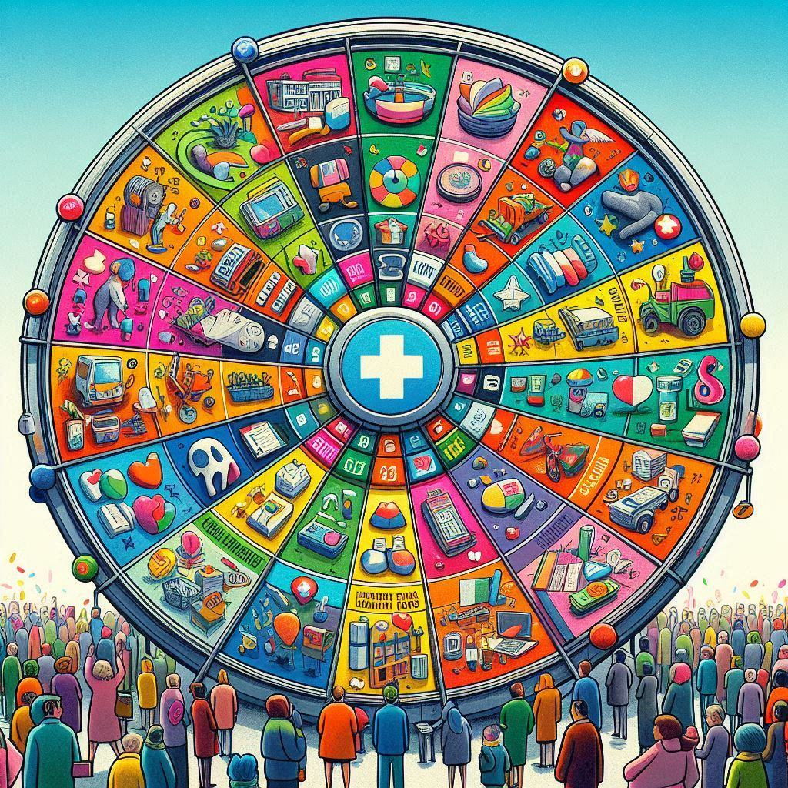
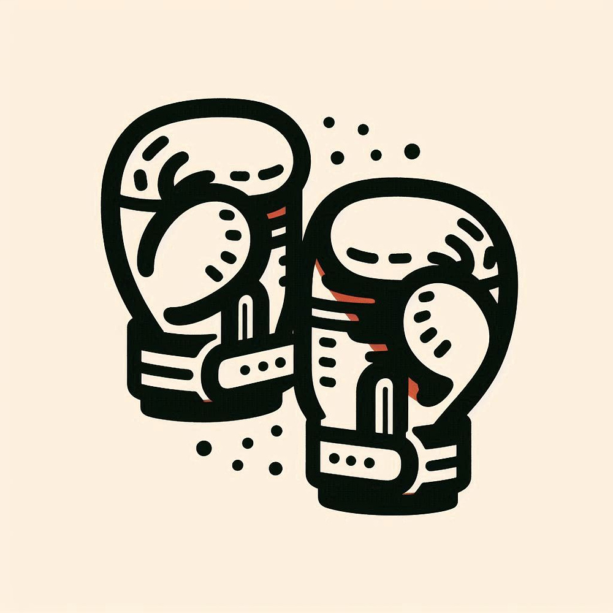
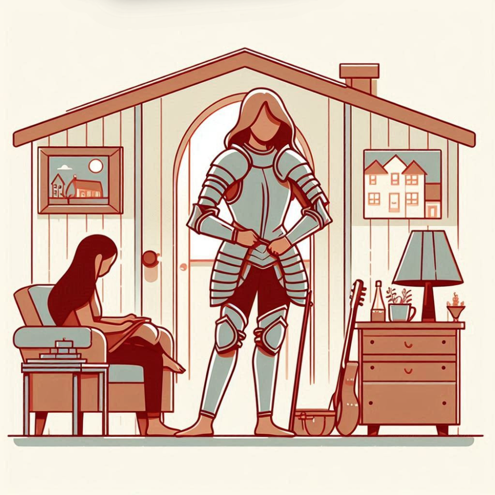
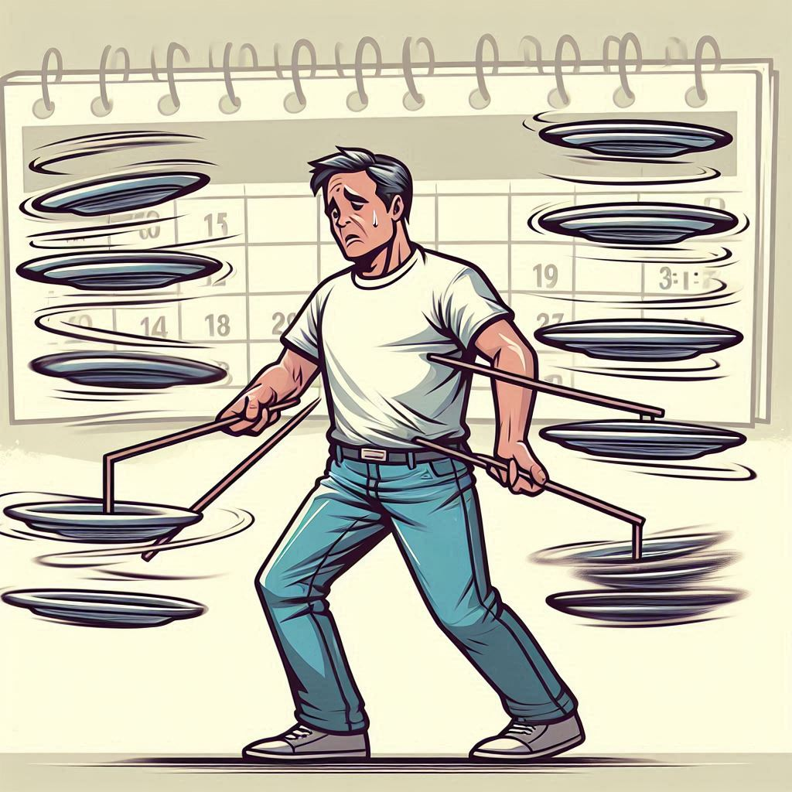
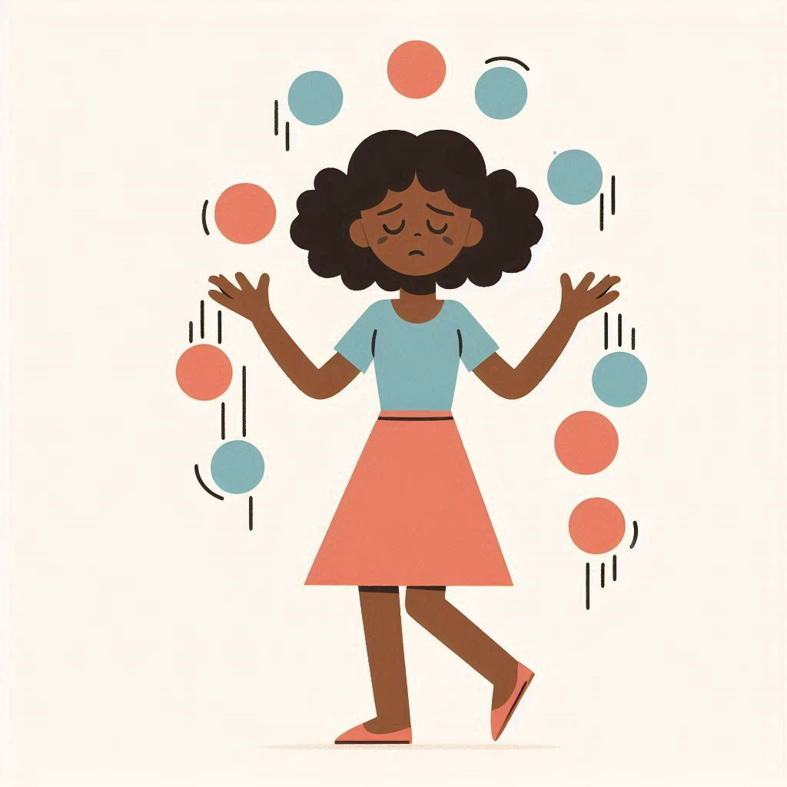
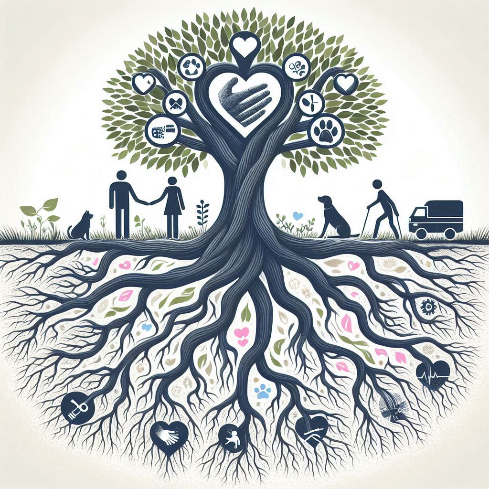
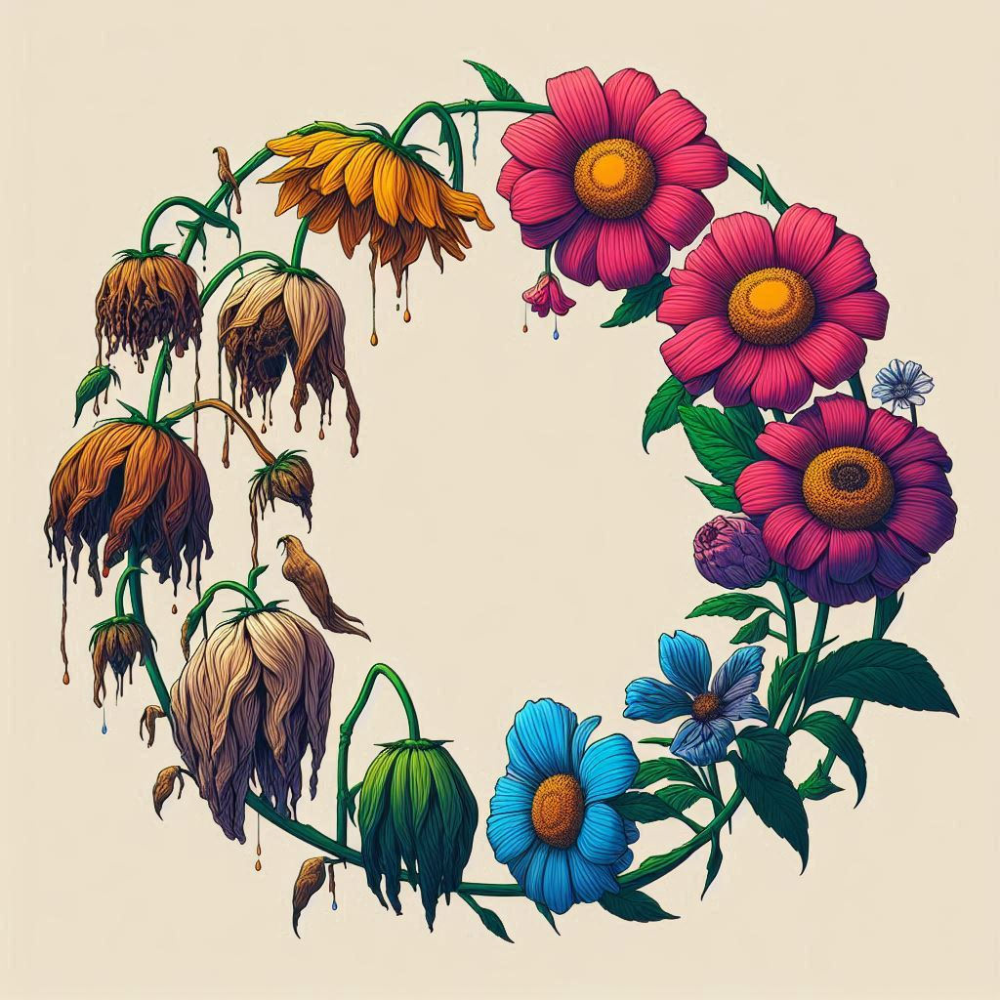

---
hide:
- toc
tags:
- Stage 1
- Methods & tools
- Qualitative insight
- Human-Centred Design
---

# Metaphors of MLTC lived experience

/// caption
Metaphor activity - Liverpool Stage 2 workshop.
///

## Overview 
A set of metaphor images brought up by people living with multiple long-term conditions as they reflected on their daily life experiences and navigating health & care systems. The images are generated using AI and validated through a workshop. They serve as visual tools to prompt discussion and convey MLTC experiences in a relatable and accessible way.

## Application & use 
In Stage 1, metaphors emerged from activity books, interviews, and focus groups with people with MLTC. Metaphors that were said were translated into AI-generated images and validated through a workshop which our public advisors helped to facilitate. During the workshop, participants refined existing images, generated new ones, and discussed the use of AI to represent their experiences. 
  The resulting images were later used in our Stage 2 workshop with health, care, and VCFSE stakeholders as an icebreaker and to prompt discussion on their views of MLTC health and care systems

## Results & insights
People with lived experience thought that the images helped to represent their experiences and highlighting: the burdens of daily life with MLTC; difficulties navigating a complex and unclear system; the emotional and mental toll of MLTC and the critical need for support. Participants in the workshop appreciated having a set of images, because different images resonated on different days, reflecting the shifting nature of living with MLTC. 
  The images also sparked meaningful discussions among health system stakeholders, who used them to articulate their understanding of MLTC systems and build empathy for those affected.
  

## Image gallery 

### Navigating a complex & unclear system

| Image     | Keywords                    | 
| --------- |-------------------------------- | 
|  {width=50%}  | *lottery, gameshow* | 
|  {width=50%}  | *blindfolded assault course* |
|  {width=50%}  | *cloak and dagger, secretive processes* |
|  {width=50%} | *fights, battles* |
|  {width=50%}  | *armour, ready for battle* |
|  {width=50%}  | *obstacles* |

### Managing the burdens of daily life with MLTC

| Image     | Keywords                     |
| --------- |-------------------------------- |
| {width=50%}   | *heavy load, infinite climb* |
| {width=50%}  | *spinning plates* |
| {width=50%}   | *juggling* |
| {width=50%}  | *round and round constant washing machine* |
| {width=50%}   | *navigating a storm* |

### Emotional & mental toll of MLTC & critical need foor support

| Image     | Keywords                     | 
| --------- |-------------------------------- | 
| {width=50%}   | *tree of support* |
| {width=50%}  | *thick fog* |
| {width=50%}   | *left to rot* |
| {width=50%}   | *blooming and wilting, cycles* |
| {width=50%}   | *dark place*|
| {width=50%}   | *light and dark*|

