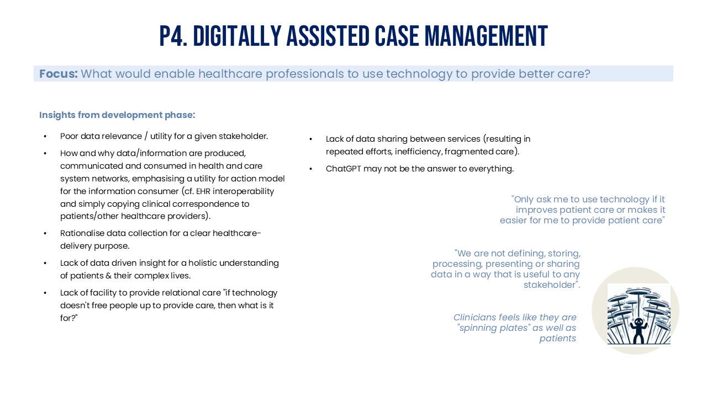

---
hide:
- toc
tags:
- Methods & tools
- Report
---

# Liverpool sandpit report

*8th November 2024*

## Context

### About SysteMatic 

SysteMatic brings together researchers from the Universities of Liverpool and Glasgow to develop a plan to design and engineer health systems for people living with Multiple Long-Term Conditions (MLTC).  

This work is supported by funding from the National Institute for Health Research (NIHR) Systems Engineering Innovation hubs for Multiple long-term Conditions (SEISMIC) scheme. The project is currently in its 18-month development phase, spanning from July 2023 to December 2024. In January 2025, we will submit an application for a full-scale programme, which will be funded between £3-6 million over five years.  

### Findings from the development phase; Introducing themes, provocations & pillars for SysteMatic
The [development phase](../about-systematic/development-stage.md) brought together those with lived experience of MLTCs, health/care professionals, scientists, engineers, social scientists, artists and designers to identify, prioritise and co-design a programme of work focused on key challenges to health and care systems. The protocol was published in the Journal of Multimorbidity and Comorbidity - [‘Developing SysteMatic: Prevention, precision and equity by design for people living with multiple long-term conditions’](https://journals.sagepub.com/doi/10.1177/26335565241272682).

Findings from the development phase highlight the following key focuses:

1. Working age population, especially those with combined mental and physical health conditions.
2. Prevention, precision and equity "by design" (the right care, at the right time in the right place).
3. Coherent and fluid communication between patients, carers, clinicians, the care and voluntary sector, moving from a passive concept of data supporting care to emphasising actionable information that 'makes care happen' - from available data to actionable information.
4. Locating opportunity for optimising and innovating on existing systems while actively considering when to reconstruct and transition the delivery of care.
5. Place-based patient-centred problems - engaging and delivering healthcare using civic principles, avoiding the assumption that a solution developed for one community can be transplanted to any other.

Figure 1 shows the proposal for SysteMatic resulting from the development phase. It includes three themes (Prevention, Self-Management, and Care Navigation) and 5 provocations (P1-5).  Three pillars will support the operationalisation of the eco-system: Data Science & Engineering, Rapid Evaluation Methodology, Health Citizenship & Innovation. The Equity Learning System will analyse and prioritise according to programmable equity in multiple long-term conditions’ prevention, precision and payment to address life-course inequalities and will formulate systems engineering problems and projects. 

To operationalise SysteMatic, and build a better healthcare system for people with multiple long-term conditions, collaboration with industry, local authority and voluntary sector is essential. Sandpit events were held locally in Liverpool and Glasgow to share insights from the development phase, and refine the SysteMatic proposal. This report shares findings from the Liverpool Sandpit event. 

/// caption
Figure 1. SysteMatic proposal (work in progress) - resulting from the development phase
///

## Sandpit Aim & Remit 

### Aims of Sandpit:

- Convene system stakeholders and industry partners 
- Develop/refine the SysteMatic proposal 
- Build partnerships to integrate SysteMatic into the local ecosystem. 

### Sandpit agenda:

- Highlights from the development project: Health Intelligence Work, People Insight work, Public Involvement and Systems Science 
- Exploration of proposed 3 themes and 5 provocations 
- Exploration of 3 pillars and building sustainable collaborative partnerships
- SysteMatic action plan

Attendees were provided handouts which included: 

- [Overview of SysteMatic and learnings from the development phase](../assets/Liverpool-Sandpit-Handout.pdf){target="_blank"}
- [Prompt sheet for each provocation with relevant insights from the development phase](../assets/Liverpool-Sandpit-Provocations.pdf){target="_blank"} 

Sandpit attendees:  
The project team at CHIL have existing relationships with individuals across the Health and Care Sector, Industry and Knowledge Sector who were all invited to attend the Sandpit event. There were representatives from the Cheshire and Merseyside ICB, Graphnet Health, Amazon Web Services, Health Innovation North West Coast and other University of Liverpool colleagues who work in the Knowledge Sector. A total of 20 external individuals attended the event alongside the Systematic project team (which includes our Public Advisors).

## Aligning SysteMatic with partner goals and system priorities 

The sandpit attendees felt that the areas of focus outlined in the SysteMatic proposal, including the themes and provocations, resonated strongly with their organisational and current system priorities. They particularly appreciated the proposal's alignment with the recent Darzi report's emphasis on equity, technology, and community care. However, attendees highlighted the importance of framing the provocations carefully to ensure they reflect what matters most to patients and well as system priorities. For example, they suggested revisiting wording in P2 “Preventing loss of healthy life”, which they felt focused too heavily on harm and might unintentionally overlook broader priorities.  

Key points of resonance with cross-sector attendees included:

**Technology and data integration**  
Attendees were interested in leveraging technology for prevention and to support patients throughout their care journeys; enhancing data sharing across the healthcare economy to drive improvements; and improving patients’ access to and control over their own data.  

**Breaking down silos**   
The problem of silos in care delivery for people with MLTC was also recognised, with attendees advocating for approaches that improve both patient experience and the efficiency of care systems.  

**Strengthening prevention efforts**  
Attendees also noted the importance of the prevention theme, saying that currently there are many missed opportunities for both medical and social interventions.   

**Equity and inclusion**  
Equity was a central concern, with participants emphasising the importance of ensuring that technological solutions do not increase inequalities. They identified key groups whose voices should be included in future work, including homeless individuals, drug users, and people with neurodiversity.  

**Systems approach**  
They remarked on the value of the systems approach (optimise, innovate, transition), highlighting the need to sometimes reimagine the healthcare system rather than provide sticking plaster solutions within a broken one.  

## Key Insights on 5 provocations for SysteMatic

### P1 - Prevent medicines harm

#### Findings from the development phase

#### Insight from the sandpit

Attendees recognised the importance of addressing polypharmacy, especially given the high rates and associated poor outcomes in Cheshire and Merseyside. The provocation aligns closely with Integrated Care Board (ICB) priorities and complements their newly developed polypharmacy strategy. Participants emphasised the need to enhance patient education and engagement with medication management, proposing:  

- Improved systems for patients to track and monitor side effects, enabling greater control over their health.
- Technology to support preparation and follow-up for structured medication reviews, such as tools to record physiological parameters (e.g., weight, blood pressure) and adverse side effects.
- AI-assisted methods to streamline medication reviews by analysing patient data and minimising the time required for healthcare professionals.
- Non-judgmental, patient-friendly tools (e.g., conversational AI or a "TripAdvisor"-style feedback system for medications) to align patient and practitioner goals.
- Solutions to prevent the continuous flow of medications being added unnecessarily, fostering more informed prescribing practices.
- 
Equity was also a key consideration, with participants stressing the importance of ensuring that any technological solutions are accessible and inclusive.

### P2 - Preventing loss of healthy life

#### Findings from the development phase

#### Insight from the sandpit

Attendees criticised the double negative of this provocation. They suggested reframing the focus to emphasise maximising quality of life rather than solely reducing harm.  

Attendees were interested in identifying key tipping points and social determinants that often precipitate health deterioration, many of which occur outside traditional healthcare systems, such as:

- Changes to benefits or support services (e.g., PIP, carer support).
- Transitions in housing or employment.
- Mental health challenges while on waiting lists for care.  

Which of these tipping points / critical events would it be cost effective to intervene in?  

There was an interest in considering households as a unit with MLTC, rather than just individuals. This aligns well with ongoing work around ‘complex households’ in Cheshire and Merseyside. This would also speak to some of the insights around carers than came up in the development phase - how the health of individuals within the household is interlinked. Need to keep carers healthy to keep household healthy.  

Attendees highlighted opportunities to leverage broader civic data (e.g., social services, community data) and technology (e.g., wearables, pattern monitoring) to identify households at risk and intervene earlier. For example:

- Using community-based systems, such as tracking attendance at local hubs, community/neighbour reporting, to flag potential declines in health.
- Exploring simple, non-intrusive technologies to monitor patterns of activity and intervene before significant deterioration occurs.
- Collaborating across systems to address broader social and environmental factors affecting health.
  
The group also discussed how the most effective prevention often begins in childhood. This ties into Alder Hey’s Innovation 2030 strategy, "Today’s child, tomorrow’s healthier adult," which looks at developing physical, digital, and automated solutions to optimise healthcare delivery and resources, focusing on acute and chronic childhood conditions such as asthma, obesity, and neurodevelopmental conditions.

### P3 - Living with combined physical and mental health conditions

#### Findings from the development phase

#### Insight from the sandpit

System stakeholders and lived experience participants strongly resonated with this provocation, recognising the siloed nature of care and challenges to self-management of physical and mental MLTCs. Key barriers include fragmented information flows, disease-focused guidelines, and lack of interoperability between systems. Proposed solutions included:

- Developing digital "concierge" systems (e.g., voice-activated assistants) to help patients navigate care, communicate their needs and self manage.
- Creating bi-directional data-sharing platforms to build holistic patient profiles and inform personalised care.
- Establishing community diagnostic centres to streamline care by offering multiple tests and assessments in one location.
- Employing wearables and ambient sensors to collect data closer to the patient’s daily life, improving the accuracy and relevance of insights.

Participants also highlighted the importance of predictive tools that leverage rarely captured data to inform care decisions and anticipate future needs.

### P4 - Digitally assisted case management 

#### Findings from the development phase

#### Insight from the sandpit

Attendees saw significant potential in leveraging digital technologies to streamline case management, aid resource allocation and scale solutions which enable the system to work smarter and harder. Key themes included:

- Unified shared care record solution across whole of Cheshire and Merseyside. 
- Developing AI tools to reduce clinical bias and tailor individualised pathways through healthcare based on patients’ clinical histories, integrating both coded and natural language data.
- Adoption of care planning within the care record.
- Creating a natural language model that people without data skills can ask questions and put to work. 
- Empowering patients and carers to ask questions and contribute to pathway design, ensuring solutions reflect lived experiences.
- Simplifying care pathways and reducing the burden/number of hospital visits through digitally informed decision-making.
  
Participants emphasised the need for scalable, evidence-based solutions that could influence not just local but national policy and investment. They also stressed the importance of shared learning across regions and internationally to support the implementation of innovative practices.

### P5 - Collaborative care networks 

#### Findings from the development phase

#### Insight from the sandpit  

Attendees recognised the critical need for better-connected care systems to address the challenges of fragmented services and improve patient experiences. Key priorities included:

- Addressing the lack of interoperability between organisations to ensure seamless information flow and coordination.
- Creating systems that simplify navigation for patients and carers, such as unified shared care records.
- Leveraging digital tools to foster collaboration between healthcare providers, community organisations, and social care systems.
- Developing networks that centre on patients’ holistic needs (rather than just disease), ensuring care is equitable and person-focused.

Participants emphasised that building collaborative networks requires both technological innovation and cultural shifts within healthcare systems to prioritise integration and equity.

## SysteMatic 3 pillars; Fostering innovative sustainable partnerships 

Developing innovative, sustainable partnerships is critical to ensuring the success of the hub and the effective delivery of its pillars. The following considerations were discussed by Sandpit attendees:  

**Tailored Collaboration Approaches**  
Partnerships need to reflect the unique capacities and goals of each organisation involved.
By co-designing initiatives with input from diverse partners, including primary care networks (PCNs), voluntary, community, social, and faith-based enterprises (VCSFEs), and public sector stakeholders, the hub can foster buy-in and alignment across sectors.  

**Ensuring State-of-the-Art Practices**  
Attendees emphasised the importance of regularly reviewing methodologies to ensure practices remain cutting-edge:

- Conduct regular assessments of feasibility, effectiveness, and scalability.
- Leverage smart methodologies to measure the impact of initiatives such as social prescribing.
- Integrate evidence-based practices with emerging technologies and data insights. A robust focus on continuous learning will ensure the hub remains at the forefront of addressing health system challenges.
  
**Sustainability through Strategic Disinvestment**  
Ensuring sustainability involves identifying areas of inefficiency within current systems and reallocating resources effectively:

- Identify defunct services that can be replaced with innovative, cost-effective solutions.
- Use feasibility and impact analyses to prioritise areas for disinvestment and reinvestment.
  
This approach not only aligns with commissioning priorities but also helps mitigate the risk of adding redundant layers to existing services.  

**Scaling with Commissioning Potential**  
Attendees highlighted the need for initiatives with the potential for rapid scalability to meet broader commissioning needs:

- Pilot projects should be designed with scalability in mind, focusing on clear pathways for implementation.
- Evidence of impact must be generated early and communicated effectively to decision-makers.  

**Understanding and Leveraging Assets**  
The VCSFE sector plays a critical role in supporting health and wellbeing, yet its full potential often remains underutilized:

- Map and understand the assets available within communities to maximise their impact.
- Build partnerships that recognise and integrate these assets into broader health and care strategies.
  
**Innovative Metrics for Impact**  
Measuring the success of interventions requires smart and inclusive methodologies:

- Develop tools to assess both direct and indirect outcomes of initiatives, ensuring a comprehensive understanding of their value.
- Focus on capturing the broader social and economic impact of innovations, particularly those targeting prevention and equity.

## Project next steps 

Systematic stage 2 grant application will be submitted to NIHR in January 2025.  
Research plan will be developed in accordance with diverse stakeholder input  including recommendations from the Sandpit event.   
Partnerships with individuals and organisations who attended the event and indicated that they would like to be involved going forward will be maintained and grown.

