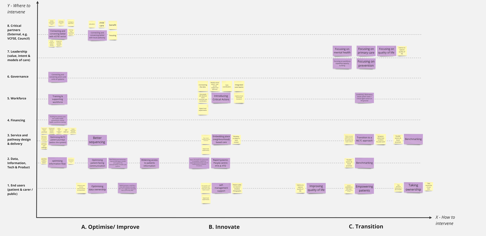

# Problem co-prioritisation canvas

:material-download: [Prioritisation framework template](../assets/problem-prioritisation.md){target="_blank"}  

## Overview 

It is important to be aware that no static ‘solution’ is possible to a living evolving web of interconnected problems. In addressing complex, systemic problems, by intervening at multiple levels and points of intervention, instead of seeking single 'problem solutions’, we can help to collectively steer the system in the desired direction.[^1] The problem prioritisation canvas developed during SysteMatic consists of 2 axes for exploring *where* (relating to health system building blocks[^2]) and *how* (relating to [3 orders of MLTC systems science](../systems-science/orders.md)) we might intervene. 

## Application & use 

The canvas can be used for:

- Introducing & testing diverse strategies (diversified problem tackling)
- Progressing a stream of parallel and prioritised briefs (multiple problems tackling)
- Targeting multiple system building blocks in each brief (linked problems and building blocks tackling)

**Read more about the prioritisation framework here:**  
:material-download: [Co-identifying and co-prioritising key challenges in MLTC systems - Liverpool - Stage 2 Report](){target="_blank"}

## References

[^1]:
  Van der Bijl-Brouwer, M., & Malcolm, B. (2020). Systemic design principles in social innovation: A study of expert practices and design rationales. She Ji: The Journal of Design, Economics, and Innovation, 6(3), 386-407.
[^2]:
  Indicators, A. H. O. (2010). Monitoring the building blocks of health systems. Geneva, Switzerland: WHO Document Production Services.
